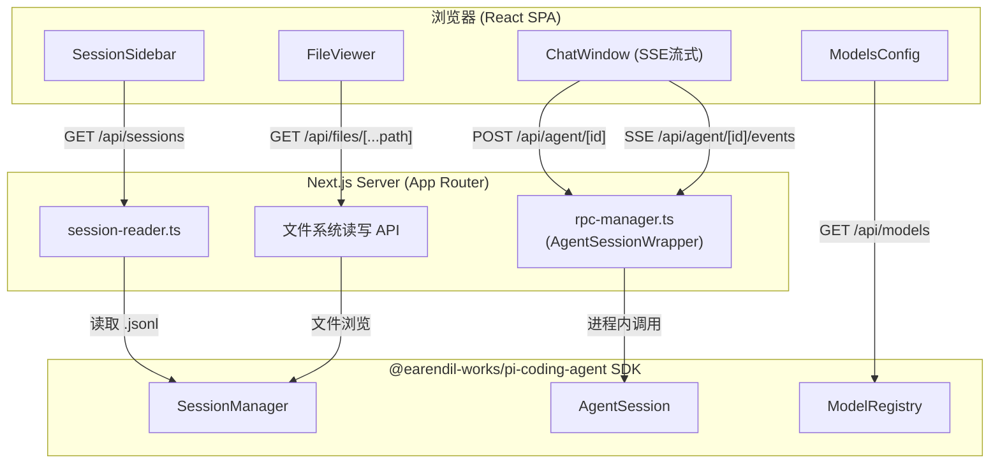
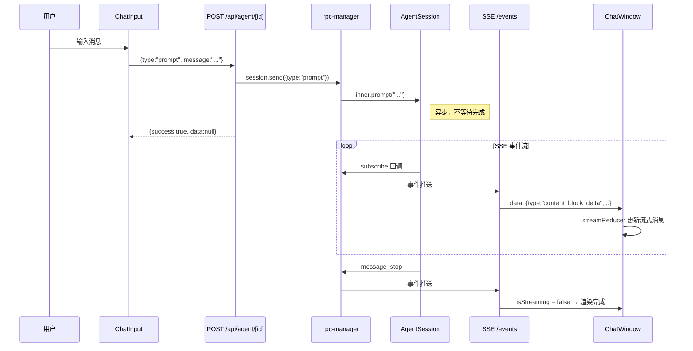

# Pi Web 项目深度分析报告

> 版本：0.6.11 · 分支：feature/windows-native-exe · 日期：2026-05-26

---

## 1. 项目概述

**pi-web**（`@agegr/pi-web`）是 [pi coding agent](https://github.com/earendil-works/pi-coding-agent) 的 Web 前端界面。它既可通过 `npm run dev` 进行开发调试，也可作为 npm CLI 工具安装后通过 `pi-web` 命令启动生产服务器（端口 30141），自动打开浏览器。

### 核心定位

- 为 pi 编程助手提供可视化的聊天交互界面
- 管理多个 Agent 会话（创建/切换/分支/Fork/删除）
- 实时流式展示 AI 响应与工具调用过程
- 浏览工作区文件、配置模型与 Skills

---

## 2. 技术栈

| 层面 | 技术 | 版本 |
|------|------|------|
| 全栈框架 | Next.js (App Router) | 16.2.1 |
| UI 框架 | React | ^19.2.4 |
| 样式方案 | Tailwind CSS + CSS 变量主题 | ^4.2.2 |
| Markdown 渲染 | react-markdown + remark-gfm | ^10.1.0 |
| 代码高亮 | react-syntax-highlighter (Prism) | ^16.1.1 |
| Agent SDK | @earendil-works/pi-coding-agent | ^0.75.5 |
| AI 基础库 | @earendil-works/pi-ai | ^0.75.5 |
| 提供商图标 | @lobehub/icons | ^5.6.0 |
| 语言 | TypeScript (strict) | ^5 |
| 构建 | Next.js 内置 webpack | — |
| 发布 | npm 公共仓库 (CLI 入口 bin/pi-web.js) | — |

**无外部状态管理库** — 全部使用 React state + useReducer。
**无 UI 组件库** — 所有组件手写 CSS-in-JS（通过 CSS 变量实现主题系统）。

---

## 3. 架构设计

### 3.1 整体架构图



### 3.2 数据流：单次对话的完整生命周期



### 3.3 两种会话访问模式

| 模式 | 触发场景 | 实现 | AgentSession |
|------|---------|------|-------------|
| **只读浏览** | 侧边栏点击会话 | 直接读取 `.jsonl` 文件（`session-reader.ts`） | 不创建 |
| **交互对话** | 发送消息/获取状态 | `startRpcSession()` 创建 wrapper | 进程内创建 |

---

## 4. 目录结构与文件详解

### 4.1 项目根目录

```
pi-web/
├── bin/pi-web.js        # CLI 入口：启动 next start 并打开浏览器
├── app/                 # Next.js App Router 页面与 API
├── components/          # React 组件
├── hooks/               # 自定义 Hooks
├── lib/                 # 服务端/共享工具库
├── docs/                # 文档
├── public/              # 静态资源
├── package.json         # 包配置
├── next.config.ts       # Next.js 配置
├── tailwind.config.ts   # Tailwind 配置
├── tsconfig.json        # TypeScript 配置
├── eslint.config.mjs    # ESLint 配置
└── postcss.config.mjs   # PostCSS 配置
```

### 4.2 API 路由 (`app/api/`)

| 路由 | 方法 | 功能说明 |
|------|------|---------|
| `/api/sessions` | GET | 列出所有会话 |
| `/api/sessions/[id]` | GET/PATCH/DELETE | 读取会话详情/重命名/删除 |
| `/api/sessions/[id]/context` | GET | 获取指定分支叶节点的上下文（`?leafId=`） |
| `/api/sessions/new` | GET | 已弃用，返回 410 |
| `/api/agent/new` | POST | 创建新会话并立即发送首条消息 |
| `/api/agent/[id]` | GET/POST | 获取运行状态 / 发送命令 |
| `/api/agent/[id]/events` | GET | SSE 事件流（含 30s 心跳） |
| `/api/files/[...path]` | GET | 文件列表或内容（安全根限制） |
| `/api/models` | GET | 可用模型列表 + thinking levels + 默认模型 |
| `/api/models-config` | GET/PUT | 读写 `~/.pi/agent/models.json` |
| `/api/skills` | GET/PATCH | 获取 skills / 切换 disable-model-invocation |
| `/api/skills/search` | GET | 搜索远程 skills |
| `/api/skills/install` | POST | 安装 skill |
| `/api/auth/providers` | GET | OAuth 提供商列表（排除 anthropic） |
| `/api/auth/all-providers` | GET | 所有提供商（含 API Key 与 OAuth） |
| `/api/auth/login/[provider]` | GET/POST | 发起 OAuth 登录（GET=SSE 流 / POST=提交 auth code） |
| `/api/auth/logout/[provider]` | POST | OAuth 登出 |
| `/api/auth/api-key/[provider]` | GET/POST | API Key 查询/设置 |
| `/api/auth/all-providers` | GET | 所有提供商（含 API Key 与 OAuth） |
| `/api/default-cwd` | POST | 创建 `~/pi-cwd-YYYYMMDD` 目录 |
| `/api/home` | GET | 返回系统 home 目录路径 |

### 4.3 核心库 (`lib/`)

#### `rpc-manager.ts` — Agent 会话生命周期管理

这是整个项目最核心的服务端模块，负责：

- **AgentSessionWrapper**：封装 `AgentSessionLike`，提供事件订阅、空闲超时（10分钟自动销毁）、生命周期管理
- **全局注册表**：使用 `globalThis.__piSessions`（Map）存储活跃的 wrapper 实例，确保 Next.js 热重载后仍可访问
- **并发安全**：`globalThis.__piStartLocks` 确保同一 session 的并发 `startRpcSession` 调用共享同一个启动 Promise
- **Fork 处理**：fork 后立即销毁旧 wrapper，防止状态错乱

```typescript
// 关键生命周期
startRpcSession(id, filePath, cwd) → { session, realSessionId }
  ├── 首次：createAgentSession() → AgentSessionWrapper → 注册到 globalThis
  └── 已存在：直接返回现有 wrapper

session.send({ type: "prompt", message: "..." })
  → inner.prompt() // fire-and-forget，事件通过 subscribe 回调

session.send({ type: "fork", entryId: "..." })
  → inner.sessionManager.fork() → this.destroy() // 立即销毁旧 wrapper
```

#### `session-reader.ts` — 会话文件解析

- 使用 `SessionManager.listAll()` 扫描 `~/.pi/agent/sessions/` 下所有 `.jsonl` 文件
- `buildTree()` 构建消息树（基于 parentId）
- `buildSessionContext()` 提取指定叶节点的消息上下文
- **路径缓存**：`globalThis.__piSessionPathCache` 将 sessionId → 文件绝对路径的映射缓存在内存中

#### `agent-client.ts` — 前端 API 客户端

统一封装 `POST /api/agent/[id]` 的 fetch 调用，处理 `{ success, data, error }` 响应格式。将原先 13 处重复的 fetch 代码收敛为一行调用。

#### `normalize.ts` — ToolCall 字段归一化

Pi SDK 存储格式与前端类型存在字段名差异：

| Pi 存储格式 | 前端类型 (`ToolCallContent`) |
|------------|---------------------------|
| `id` | `toolCallId` |
| `name` | `toolName` |
| `arguments` | `input` |

`normalizeToolCalls()` 在两个路径都执行转换：
1. 文件加载时（`session-reader.ts`）
2. SSE 流式接收时（`ChatWindow.handleAgentEvent()`）

#### `file-paths.ts` — 跨平台路径工具

- `normalizeFilePathSlashes()`：Windows 反斜杠 → 正斜杠
- `encodeFilePathForApi()`：路径分段 URI 编码（用于 `/api/files/[...path]`）
- `getRelativeFilePath()`：基于 cwd 计算相对路径
- `joinFilePath()`：安全的路径拼接

#### `npx.ts` — 安全的 npx 调用

绕过 Windows 上 `npx.cmd` 的 shell 限制（Node.js 20.12+ CVE-2024-27980），直接定位并调用 `npx-cli.js`。

#### `pi-types.ts` — SDK 类型薄封装

定义 `AgentSessionLike` 接口，解耦前端代码对 SDK 具体实现的依赖。

#### `types.ts` — 共享类型定义

定义了所有消息类型：`UserMessage`、`AssistantMessage`（含 usage/cost）、`ToolResultMessage`、`CustomMessage`，以及内容块类型（`TextContent`、`ImageContent`、`ThinkingContent`、`ToolCallContent`）。

### 4.4 组件 (`components/`)

#### `AppShell.tsx` — 顶层布局

- 管理 URL 状态（session id 通过 searchParams 传递）
- 侧边栏 + 聊天区 + 标签页的三栏布局
- 统管分支导航器、系统提示词、会话统计（token/cost）、上下文使用率等状态
- 单一活跃下拉面板（branches / system 互斥）

#### `ChatWindow.tsx` — 聊天主窗口

- SSE 连接管理（自动重连）
- 流式状态机（`streamReducer`：start → update → end）
- Agent 阶段指示（"Thinking..." / "Running tool..." / "Waiting for model..."）
- 空闲打字机动画（18 条随机短语循环）
- Fork / Steer / FollowUp 操作
- Compact（手动/自动压缩上下文）

#### `ChatInput.tsx` — 输入栏

- 多行文本输入 + 自动增高
- 图片拖拽/粘贴上传（base64 编码）
- 模型选择下拉
- 工具预设（Off/Low/High 三档）
- Thinking Level 选择（auto/off/minimal/low/medium/high/xhigh）
- Steer（中途修正）和 FollowUp（追问）模式
- 音效开关
- 自动重试状态显示

#### `MessageView.tsx` — 消息渲染

- **用户消息**：蓝色背景，支持 Fork 和编辑重发
- **助手消息**：Markdown 渲染 + 代码高亮 + Thinking 折叠块 + 工具调用内联展示
- **工具结果**：内联在对应的 toolCall 下方（成对匹配 toolCallId）
- 模型名称显示、时间戳、复制按钮

#### `SessionSidebar.tsx` — 侧边栏

- 按 cwd 分组的会话树（支持 fork 父子关系展示）
- 最近使用的 5 个 cwd 快捷入口
- 内嵌 `FileExplorer` 文件浏览器
- 会话搜索/删除/重命名
- 新建会话按钮

#### `BranchNavigator.tsx` — 会话内分支导航

- 显示当前会话的分支树（线性链压缩显示）
- 高亮活跃路径
- 点击叶节点切换分支（调用 `navigate_tree`）

#### `ChatMinimap.tsx` — 滚动缩略图

- 在消息列表右侧显示缩略导航
- 用户消息蓝色节点、助手消息灰色节点
- 拖拽/点击快速定位

#### `ToolPanel.tsx` — 工具预设面板

| 预设 | 包含的工具 |
|------|----------|
| Off (none) | 无 |
| Low (default) | read · bash · edit · write |
| High (full) | read · bash · edit · write · grep · find · ls |

#### `ModelsConfig.tsx` — 模型配置

- 模态框形式，读取/写入 `~/.pi/agent/models.json`
- 25+ AI 提供商图标（使用 `@lobehub/icons`）
- 支持配置默认模型、API Key、OAuth 登录

#### `SkillsConfig.tsx` — Skills 管理

- 列出当前 cwd 下的所有 skills（使用 `DefaultResourceLoader`）
- 启用/禁用 toggle（通过修改 SKILL.md 的 `disable-model-invocation` frontmatter）
- 搜索远程 skills / 安装 skills

#### `FileExplorer.tsx` — 文件树

- 懒加载目录内容（展开时才请求）
- 文件图标按扩展名匹配（[FileIcons.tsx](components/FileIcons.tsx) 提供 20+ 类型图标）
- `@` 引用：点击文件可在输入框插入 `@relative/path`

#### `FileViewer.tsx` — 文件查看器

- 代码文件：语法高亮 + 行号
- 图片文件：直接展示
- 音频文件：HTML5 audio 播放器
- 内置 Myers diff 算法（用于对比文件变更）
- 文件大小限制：文本 256KB、图片 10MB

#### `TabBar.tsx` — 标签栏

- 支持 Chat 标签 + 多个文件标签
- 活跃标签高亮，可关闭文件标签

### 4.5 Hooks (`hooks/`)

#### `useAgentSession.ts` — 核心 Hook

```typescript
interface UseAgentSessionOptions {
  session: SessionInfo | null;
  newSessionCwd: string | null;
  onAgentEnd?: () => void;
}
```

功能：
- SSE 连接建立与断开
- 流式消息状态机（`useReducer`）
- 发送消息 / 中止 / Fork / Compact / 模型切换 / Steer / FollowUp
- 上下文使用率监控
- Agent 阶段追踪（thinking / running_tools / waiting_model）
- 工具列表获取与预设推断

#### `useTheme.ts` — 主题切换

- 使用 `useSyncExternalStore` 实现主题状态同步
- View Transitions API：圆形擦除动画（从点击位置向外扩散）
- `prefers-reduced-motion` 尊重用户偏好
- `localStorage` 持久化

#### `useAudio.ts` — 通知音效

- Agent 完成时播放 C5-E5 双音提示
- 音量渐入渐出（0.18 峰值 → 0.001 衰减）
- 开关状态持久化到 `localStorage`

#### `useDragDrop.ts` — 图片拖拽

- 拖拽悬停视觉反馈
- 仅接受图片类型文件
- 计数器处理嵌套元素事件

---

## 5. 关键设计决策与陷阱

### 5.1 AgentSession 生命周期

**问题**：Next.js 热重载会丢弃模块级变量，导致 AgentSession 实例丢失。

**方案**：使用 `globalThis.__piSessions` 存储所有活跃的 `AgentSessionWrapper`，`globalThis` 不受热重载影响。

**空闲超时**：10 分钟无操作自动销毁 wrapper，释放内存。

**并发启动**：`globalThis.__piStartLocks` 确保同一 session id 的并发请求共享同一个启动 Promise，避免重复创建。

### 5.2 Fork 必须立即销毁旧 Wrapper

**问题**：`AgentSession.fork()` 会**原地修改** wrapper 的内部状态 — fork 之后，`inner.sessionId` 变为新会话的 id。如果旧 wrapper 仍然留在注册表中，后续对原始 session id 的请求会拿到已 fork 的错误状态。

**方案**：`send({ type: "fork" })` 捕获 `newSessionId` 后，**立即调用 `this.destroy()`** 销毁旧 wrapper。下次请求原始 session id 时，会从文件重新加载干净的 AgentSession。

### 5.3 两种分支机制

| 特性 | Fork | In-session Branch |
|------|------|-------------------|
| 存储位置 | 新的独立 `.jsonl` 文件 | 同一文件内 |
| 触发方式 | 用户消息上的 Fork 按钮 | Continue 按钮 / BranchNavigator |
| 侧边栏 | 显示为子节点（通过 `parentSession` 头部字段） | 不显示新节点 |
| 实现 | `sessionManager.fork()` + 销毁旧 wrapper | `navigate_tree` 命令 |
| 上下文切换 | 加载新文件 | `/api/sessions/[id]/context?leafId=` |

### 5.4 ToolCall 字段归一化

Pi SDK 内部存储 toolCall 使用的字段名与前端类型定义不一致：

```typescript
// Pi SDK 存储格式
{ type: "toolCall", id: "xxx", name: "read", arguments: { ... } }

// 前端类型定义 (ToolCallContent)
{ type: "toolCall", toolCallId: "xxx", toolName: "read", input: { ... } }
```

`normalizeToolCalls()` 在两个入口都执行转换，确保前端始终使用统一的字段名。

### 5.5 SSE 重连机制

页面刷新时，`ChatWindow` 挂载后调用 `GET /api/agent/[id]`。如果返回 `state.isStreaming === true`，说明 agent 仍在运行，自动重新建立 SSE 连接。同时同步 `thinkingLevel` 和 `isCompacting` 状态。

### 5.6 主题切换动画

使用 View Transitions API 实现圆形擦除动画：

1. 禁用默认的 cross-fade 动画
2. 在 `transition.ready` 后使用 `Element.animate()` 驱动 `clip-path: circle()` 动画
3. 动画原点为用户点击位置
4. `layout.tsx` 内嵌 inline script 在 DOM 渲染前读取 `localStorage` 中的主题设置，避免闪烁

### 5.7 Compaction 事件兼容

新版 pi 发射 `compaction_start` / `compaction_end`，旧版发射 `auto_compaction_start` / `auto_compaction_end`。`handleAgentEvent` 同时接受两套事件名，确保向后兼容。

### 5.8 Windows 兼容性

- **路径处理**：`file-paths.ts` 统一将反斜杠转为正斜杠
- **npx 调用**：`npx.ts` 绕过 `npx.cmd`（Node.js 20.12+ 拒绝在 `execFile` 中执行 `.cmd` 文件），直接定位 `npx-cli.js`
- **CLI 入口**：`bin/pi-web.js` 使用 `process.execPath` 直接调用 next 的 JS 入口，避免 shell 相关的路径问题

### 5.9 孤儿会话

如果 `.jsonl` 文件的第一行无法解析为有效的 session header，该会话会被标记为 `orphaned: true`，在侧边栏中显示为"incomplete"徽章且不可点击。

### 5.10 会话文件格式

位置：`~/.pi/agent/sessions/<encoded-cwd>/<timestamp>_<uuid>.jsonl`

```jsonl
{"type":"session","version":3,"id":"<uuid>","timestamp":"...","cwd":"/path","parentSession":"/abs/path/to/parent.jsonl"}
{"type":"model_change","id":"<8hex>","parentId":null,"provider":"zenmux","modelId":"claude-sonnet-4-6","timestamp":"..."}
{"type":"message","id":"<8hex>","parentId":"<8hex>","message":{"role":"user","content":"..."}}
{"type":"message","id":"<8hex>","parentId":"<8hex>","message":{"role":"assistant","content":[...],...}}
{"type":"message","id":"<8hex>","parentId":"<8hex>","message":{"role":"toolResult","toolCallId":"...","content":[...]}}
{"type":"compaction","id":"<8hex>","parentId":"<8hex>","summary":"...","firstKeptEntryId":"<8hex>","tokensBefore":N}
{"type":"session_info","id":"...","parentId":"...","name":"user-defined name"}
```

`entryIds[]` 是与 `messages[]` 平行的数组，将每条展示的消息映射回其 `.jsonl` entry id，用于 fork 和 navigate_tree 调用。

---

## 6. CSS 主题系统

### 6.1 CSS 变量定义 (`app/globals.css`)

```css
:root {
  --bg: #ffffff;           /* 主背景 */
  --bg-panel: #f5f5f5;     /* 面板背景 */
  --bg-hover: #eeeeee;     /* 悬停背景 */
  --bg-selected: #e8e8e8;  /* 选中背景 */
  --border: #e0e0e0;       /* 边框 */
  --text: #1a1a1a;         /* 主文本 */
  --text-muted: #6b7280;   /* 次要文本 */
  --text-dim: #9ca3af;     /* 最淡文本 */
  --accent: #2563eb;       /* 强调色（蓝） */
  --accent-hover: #1d4ed8; /* 强调色悬停 */
  --user-bg: #eff6ff;      /* 用户消息背景 */
  --assistant-bg: #ffffff; /* 助手消息背景 */
  --tool-bg: #f9fafb;      /* 工具调用背景 */
  --bg-subtle: rgba(0,0,0,0.03); /* 微妙背景 */
}

html.dark {
  --bg: #1a1a1a;
  --bg-panel: #242424;
  --bg-hover: #2e2e2e;
  --bg-selected: #383838;
  --border: #3a3a3a;
  --text: #e8e8e8;
  --text-muted: #9ca3af;
  --text-dim: #6b7280;
  --accent: #60a5fa;
  --accent-hover: #93c5fd;
  --user-bg: #1e293b;
  --assistant-bg: #1a1a1a;
  --tool-bg: #1f2937;
  --bg-subtle: rgba(255,255,255,0.04);
}
```

### 6.2 Tailwind 集成

通过 `@theme` 指令将 CSS 变量映射为 Tailwind 颜色/字体 token，使组件可同时使用 CSS 变量和 Tailwind class。

### 6.3 View Transitions

```css
::view-transition-old(root) { animation: none; z-index: 1; }
::view-transition-new(root) { animation: none; z-index: 2; }
```

禁用默认动画，由 `useTheme.ts` 中的 `Element.animate()` 驱动 `clip-path: circle()` 过渡效果。

---

## 7. 支持的 AI 提供商

项目通过 `@lobehub/icons` 提供了 25+ AI 提供商的品牌图标：

| 提供商 | 图标类型 | 提供商 | 图标类型 |
|--------|---------|--------|---------|
| Anthropic | Mono | OpenAI | Mono |
| Google | Color | DeepSeek | Color |
| Groq | Mono | Mistral | Color |
| Moonshot | Mono | Minimax | Color |
| Fireworks | Color | HuggingFace | Color |
| Cerebras | Color | OpenRouter | Mono |
| xAI | Mono | Cloudflare | Color |
| Vercel | Mono | GitHub Copilot | Mono |
| AWS Bedrock | Color | Azure OpenAI | Color |
| Kimi | Color | Qwen | Color |
| Zhipu | Color | Cohere | Color |
| Perplexity | Color | Together | Color |
| Grok | Mono | — | — |

---

## 8. 开发与构建

### 8.1 常用命令

```bash
npm run dev          # 启动开发服务器 (port 30141)
npm run build        # 生产构建 (next build --webpack)
npm run start        # 启动生产服务器
npm run lint         # ESLint 检查
npm run release      # 版本号+1 → 构建 → 发布到 npm
```

### 8.2 类型检查

```bash
node_modules/.bin/tsc --noEmit
```

### 8.3 重要注意事项

- **不要在开发时运行 `next build`** — 会污染 `.next/` 目录，导致 `npm run dev` 异常
- **`globalThis` 用途**：存储 session 注册表、路径缓存、启动锁，确保热重载安全
- **Next.js 配置**：`serverExternalPackages` 将 pi SDK 标记为外部包，避免 webpack 打包问题

---

## 9. 统计概览

| 指标 | 数量 |
|------|------|
| React 组件 | 14 |
| 自定义 Hooks | 4 |
| 服务端/共享库 | 8 |
| API 路由 | 19（含认证 5 个 + sessions/new 410） |
| 外部状态管理库 | 0 |
| UI 组件库 | 0 |
| 支持 AI 提供商 | 25+ |
| 工具预设 | 3 档 |
| Thinking Levels | 7 级 |

---

## 10. 潜在改进方向

1. **状态管理**：随着功能增长，`AppShell.tsx` 的状态管理已较复杂，可考虑引入 Zustand 等轻量状态库
2. **测试覆盖**：当前项目未见测试文件，核心逻辑（normalize、rpc-manager、session-reader）应有单元测试
3. **错误边界**：组件级 Error Boundary 缺失，SSE 断连或数据异常可能导致整页崩溃
4. **国际化**：当前 UI 文案为英文，部分 thinking level 描述为中文（混合状态），可统一 i18n
5. **文件安全**：`/api/files` 的安全根限制依赖缓存，首次请求可能有竞态条件
6. **SSE 重连策略**：当前有 1 秒自动重连（`onerror` 中 `setTimeout` 重连），但无指数退避，高频断连可能导致请求风暴
